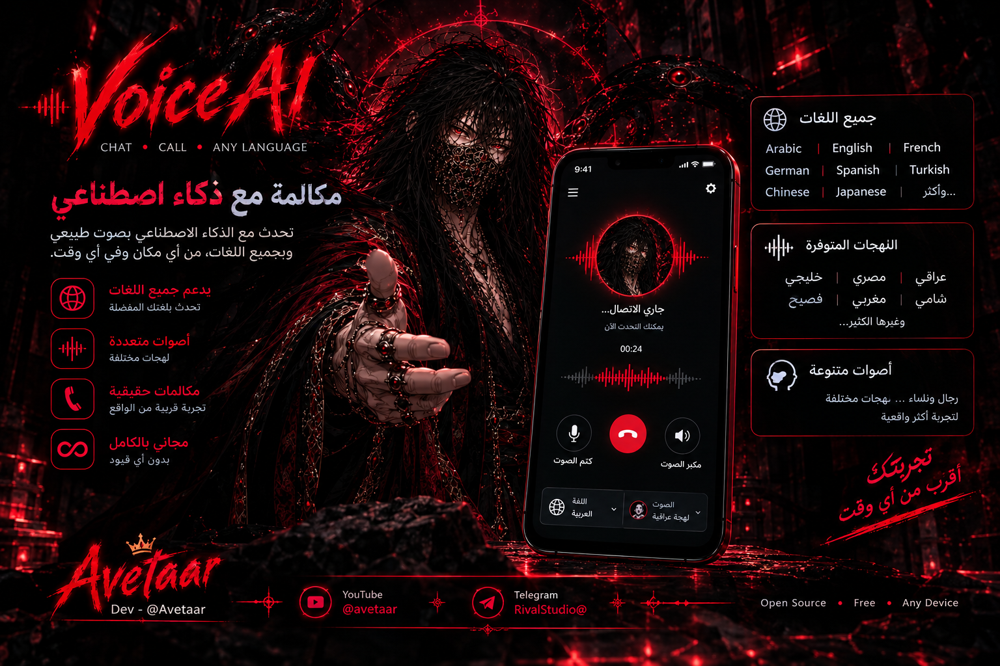

<p align="center">
  
</p>

# VoiceAI Avetaar

**Avetaar** is a browser-based voice assistant on the local network:
press the mic and speak — the browser understands you directly (no model download, no ffmpeg),
and Avetaar replies with **text and voice** in the Iraqi dialect.
It comes with an animated **plexus face** that speaks along with the voice.

- LLM: free keyless provider (auto sign-up, cached token) with automatic fallback — no API key needed
- Voice: Edge TTS with authentic Iraqi voices (Bassel / Rana / Salma / Shakir / Zariya)
- Understanding: built into the browser (Web Speech API) — nothing to download
- Optional: if you install `faster-whisper` on the server machine, audio is also understood server-side

No large models. No ffmpeg. No API keys. Only four small libraries.

## How to run (any environment — Windows / Termux / Linux)

One line:

```
git clone https://github.com/Avetaar/VoiceAI-Avetaar && python VoiceAI-Avetaar/Avetaar.py
```

On Termux:

```
pkg install git python && git clone https://github.com/Avetaar/VoiceAI-Avetaar && python VoiceAI-Avetaar/Avetaar.py
```

The launcher installs the required libraries automatically, starts the site,
prints the link in the terminal and opens it in the browser —
copy the link into Chrome on any device and talk with Avetaar.

Speech understanding needs Chrome/Chromium (Web Speech API). Open the link in Chrome.

## Structure

```
VoiceAI-Avetaar/
├── Avetaar.py               Smart launch (install → run → show link)
├── RIVAL_requirements.txt
├── AVETAAR.md               Identity and rights
├── README.md
├── RIVAL_banner.png
├── backend/
│   ├── RIVAL_app.py         Flask + endpoints
│   ├── RIVAL_config.py      Settings
│   ├── RIVAL_cert.py        Self-signed HTTPS certificate
│   ├── RIVAL_llm.py         GPT-Realtime reply
│   ├── RIVAL_tts.py         Edge TTS voice
│   └── RIVAL_sessions.py    Conversation memory
└── frontend/
    ├── RIVAL_index.html
    ├── css/RIVAL_style.css
    └── js/RIVAL_main.js · RIVAL_state · RIVAL_api · RIVAL_chat · RIVAL_face · RIVAL_voice
```

## Identity

Developer: **Avetaar** · Telegram: **@Avetaar**
Team / rights: **Rival** — [Rival channel](https://t.me/RivalStudio)

Third-party attribution is preserved in AVETAAR.md.
